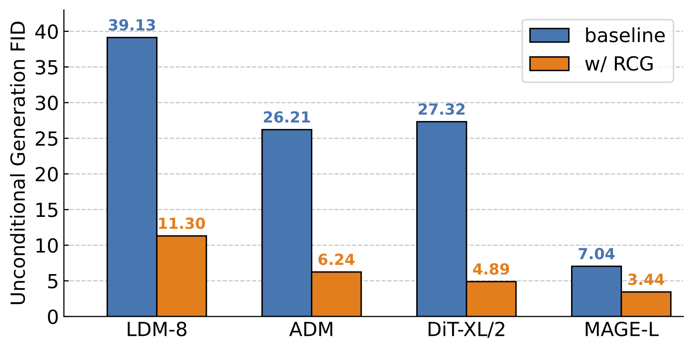

# RCG PyTorch Implementation

<p align="center">
  
</p>

This is a PyTorch/GPU implementation of the paper [Self-conditioned Image Generation via Generating Representations](https://arxiv.org/abs/2312.03701):
```
@Article{RCG2023,
  author  = {Tianhong Li and Dina Katabi and Kaiming He},
  journal = {arXiv:2312.03701},
  title   = {Self-conditioned Image Generation via Generating Representations},
  year    = {2023},
}
```

RCG is a self-conditioned image generation framework that achieves SOTA 
class-unconditional image generation performance on ImageNet-1K, bridging the 
long-standing performance gap between class-unconditional and class-conditional image generation. 

<p align="center">
  
</p>

## Preparation

### Dataset
Download [ImageNet](http://image-net.org/download) dataset, and place it in your `IMAGENET_DIR`.
Prepare the ImageNet validation set for FID evaluation:
```
python prepare_imgnet_val.py --data_path ${IMAGENET_DIR} --output_dir imagenet-val
```
### Installation

A suitable [conda](https://conda.io/) environment named `rcg` can be created and activated with:

```
conda env create -f environment.yaml
conda activate rcg
```

Download the code
```
git clone https://github.com/LTH14/rcg.git
cd rcg
```
Use [this link](https://drive.google.com/file/d/13S_unB87n6KKuuMdyMnyExW0G1kplTbP/view?usp=sharing)
to download the pre-trained VQGAN tokenizer as ```vqgan_jax_strongaug.ckpt```.

Use [this link](https://dl.fbaipublicfiles.com/moco-v3/vit-b-300ep/vit-b-300ep.pth.tar) 
to download the pre-trained moco v3 ViT-B encoder and name it as ```pretrained_enc_ckpts/mocov3/vitb.pth.tar```.

Use [this link](https://drive.google.com/file/d/1Foa2-FqhwIFYjcAAbY9sXyO-1Vwwx-_9/view?usp=sharing)
to download the pre-trained moco v3 ViT-L encoder and name it as ```pretrained_enc_ckpts/mocov3/vitl.pth.tar```.

## Usage

### RDM

To train the Moco v3 ViT-B representation diffusion model using 4 V100 GPUs:
```
python -m torch.distributed.launch --nproc_per_node=4 --nnodes=1 --node_rank=0 \
main_rdm.py \
--config config/rdm/mocov3vitb_simplemlp_l12_w1536.yaml \
--batch_size 128 --input_size 256 \
--epochs 200 \
--blr 1e-6 --weight_decay 0.01 \
--output_dir ${OUTPUT_DIR} \
--data_path ${IMAGENET_DIR} \
--dist_url tcp://${MASTER_SERVER_ADDRESS}:2214
```

To continue a previously interrupted training session, set ```--resume``` to the ```OUTPUT_DIR``` where ```checkpoint-last.pth``` is stored.

The following table provides the pre-trained weights of the 
Moco v3 ViT-B/ViT-L RDM used in the paper:
<table><tbody>
<!-- START TABLE -->
<!-- TABLE HEADER -->
<th valign="bottom"></th>
<th valign="bottom">Moco v3 ViT-B</th>
<th valign="bottom">Moco v3 ViT-L</th>
<!-- TABLE BODY -->
<tr><td align="left">Class-unconditional RDM</td>
<td align="center"><a href="https://drive.google.com/file/d/1gdsvzKLmmBWuF4Ymy4rQ_T1t6dDHnTEA/view?usp=sharing">Google Drive</a> / <a href="config/rdm/mocov3vitb_simplemlp_l12_w1536.yaml">config</a></td>
<td align="center"><a href="https://drive.google.com/file/d/1E5E3i9LRpSy0tVF7NA0bGXEh4CrjHAXz/view?usp=sharing">Google Drive</a> / <a href="config/rdm/mocov3vitl_simplemlp_l12_w1536.yaml">config</a></td>
</tr>
<tr><td align="left">Class-conditional RDM</td>
<td align="center"><a href="https://drive.google.com/file/d/1roanmVfg-UaddVehstQErvByqi0OYs2R/view?usp=sharing">Google Drive</a> / <a href="config/rdm/mocov3vitb_simplemlp_l12_w1536_classcond.yaml">config</a></td>
<td align="center"><a href="https://drive.google.com/file/d/1lZmXOcdHE97Qmn2azNAo2tNVX7dtTAkY/view?usp=sharing">Google Drive</a> / <a href="config/rdm/mocov3vitl_simplemlp_l12_w1536_classcond.yaml">config</a></td>
</tr>
</tbody></table>

### Pixel Generator: MAGE
To train a MAGE-B conditioned on Moco v3 ViT-B representations, using 64 V100 GPUs for 200 epochs:
```
python -m torch.distributed.launch --nproc_per_node=8 --nnodes=8 --node_rank=0 \
main_mage.py \
--pretrained_enc_arch mocov3_vit_base \
--pretrained_enc_path pretrained_enc_ckpts/mocov3/vitb.pth.tar --rep_drop_prob 0.1 \
--use_rep --rep_dim 256 --pretrained_enc_withproj --pretrained_enc_proj_dim 256 \
--pretrained_rdm_cfg ${RDM_CFG_PATH} --pretrained_rdm_ckpt ${RDM_CKPT_PATH} \
--rdm_steps 250 --eta 1.0 --temp 6.0 --num_iter 20 --num_images 50000 --cfg 0.0 \
--batch_size 64 --input_size 256 \
--model mage_vit_base_patch16 \
--mask_ratio_min 0.5 --mask_ratio_max 1.0 --mask_ratio_mu 0.75 --mask_ratio_std 0.25 \
--epochs 200 \
--warmup_epochs 10 \
--blr 1.5e-4 --weight_decay 0.05 \
--output_dir ${OUTPUT_DIR} \
--data_path ${IMAGENET_DIR} \
--dist_url tcp://${MASTER_SERVER_ADDRESS}:2214
```

To train a MAGE-L conditioned on Moco v3 ViT-L representations, 
change ```RDM_CFG_PATH``` and ```RDM_CKPT_PATH``` for Moco v3 ViT-L RDM, as well as the following arguments: 
```
--pretrained_enc_arch mocov3_vit_large --pretrained_enc_path pretrained_enc_ckpts/mocov3/vitl.pth.tar --temp 11.0 --model mage_vit_large_patch16
```
**Resume**: set ```--resume``` to the ```OUTPUT_DIR``` where ```checkpoint-last.pth``` is stored.

**Evaluation**: set ```--resume``` to the pre-trained MAGE checkpoint and
include the ```--evaluate``` flag in the above script.

**Pre-trained Models**:
<table><tbody>
<!-- START TABLE -->
<!-- TABLE HEADER -->
<th valign="bottom"></th>
<th valign="bottom">Rep. Cond. MAGE-B</th>
<th valign="bottom">Rep. Cond. MAGE-L</th>
<!-- TABLE BODY -->
<tr><td align="left">Checkpoint</td>
<td align="center"><a href="https://drive.google.com/file/d/1iZY0ujWp5GVochTLj0U6j4HgVTOyWPUI/view?usp=sharing">Google Drive</a></td>
<td align="center"><a href="https://drive.google.com/file/d/1nQh9xCqjQCd78zKwn2L9eLfLyVosb1hp/view?usp=sharing">Google Drive</a></td>
</tr>
<tr><td align="left">Class-unconditional Generation (w/o CFG) </td>
<td align="center">FID=4.18, IS=177.8</td>
<td align="center">FID=3.56, IS=186.9</td>
</tr>
<tr><td align="left">Class-unconditional Generation (w/ CFG) </td>
<td align="center">FID=4.31, IS=214.9 (cfg=1.0)</td>
<td align="center">FID=3.31, IS=253.4 (cfg=6.0)</td>
</tr>
<tr><td align="left">Class-conditional Generation (w/o CFG) </td>
<td align="center">FID=4.09, IS=194.9</td>
<td align="center">FID=3.49, IS=215.5</td>
</tr>
<tr><td align="left">Class-conditional Generation (w/ CFG) </td>
<td align="center">FID=4.64, IS=242.6 (cfg=1.0)</td>
<td align="center">FID=3.90, IS=300.7 (cfg=6.0)</td>
</tr>
</tbody></table>

**Visualization**: use ```viz_rcg.ipynb``` to visualize generation results.

Class-unconditional generation examples:
<p align="center">
  
</p>

Class-conditional generation examples:
<p align="center">
  
</p>


### Pixel Generator: ADM

To train an ADM conditioned on Moco v3 ViT-B representations, using 128 V100 GPUs for 100 epochs:
```
python -m torch.distributed.launch --nproc_per_node=8 --nnodes=16 --node_rank=0 \
main_adm.py \
--rep_cond --rep_dim 256 \
--pretrained_enc_arch mocov3_vit_base \
--pretrained_enc_path pretrained_enc_ckpts/mocov3/vitb.pth.tar \
--pretrained_rdm_cfg ${RDM_CFG_PATH} \
--pretrained_rdm_ckpt ${RDM_CKPT_PATH} \
--batch_size 2 --image_size 256 \
--epochs 100  \
--lr 1e-4 --weight_decay 0.0 \
--attention_resolutions 32,16,8 --diffusion_steps 1000 \
--learn_sigma --noise_schedule linear \
--num_channels 256 --num_head_channels 64 --num_res_blocks 2 --resblock_updown \
--use_scale_shift_norm \
--gen_timestep_respacing ddim25 --use_ddim \
--output_dir ${OUTPUT_DIR} \
--data_path ${IMAGENET_DIR} \
--dist_url tcp://${MASTER_SERVER_ADDRESS}:2214
```

**Resume**: set ```--resume``` to the ```OUTPUT_DIR``` where ```checkpoint-last.pth``` is stored.

**Evaluation**: set ```--resume``` to the pre-trained ADM checkpoint and
include the ```--evaluate``` flag in the above script. Set ```--gen_timestep_respacing 250``` and disable ```--use_ddim``` for better generation performance.

**Pre-trained ADM** conditioned on Moco v3 ViT-B representations can be downloaded [here](https://drive.google.com/file/d/1aEY8L3BB7QxtFOP-DUB0TGShq9L4gBIP/view?usp=sharing) (FID=7.21, IS=108.9).

### Pixel Generator: LDM

Use [this link](https://ommer-lab.com/files/latent-diffusion/vq-f8.zip) 
to download the tokenizer and name it as `vqgan-ckpts/ldm_vqgan_f8_16384/checkpoints/last.ckpt`.

To train an LDM-8 conditioned on Moco v3 ViT-B representations, using 64 V100 GPUs for 40 epochs:
```
python -m torch.distributed.launch --nproc_per_node=8 --nnodes=8 --node_rank=0 \
main_ldm.py \
--config config/ldm/cin-ldm-vq-f8-repcond.yaml \
--batch_size 4 \
--epochs 40 \
--blr 2.5e-7 --weight_decay 0.01 \
--output_dir ${OUTPUT_DIR} \
--data_path ${IMAGENET_DIR} \
--dist_url tcp://${MASTER_SERVER_ADDRESS}:2214
```

**Resume**: set ```--resume``` to the ```OUTPUT_DIR``` where ```checkpoint-last.pth``` is stored.

**Evaluation**: set ```--resume``` to the pre-trained LDM checkpoint and
include the ```--evaluate``` flag in the above script.

**Pre-trained LDM** conditioned on Moco v3 ViT-B representations can be downloaded [here](https://drive.google.com/file/d/1-qNGz5biWs9KwsjAMyR_GyciaWmF9axW/view?usp=sharing) (FID=9.08, IS=101.9).

## Contact

If you have any questions, feel free to contact me through email (tianhong@mit.edu). Enjoy!
